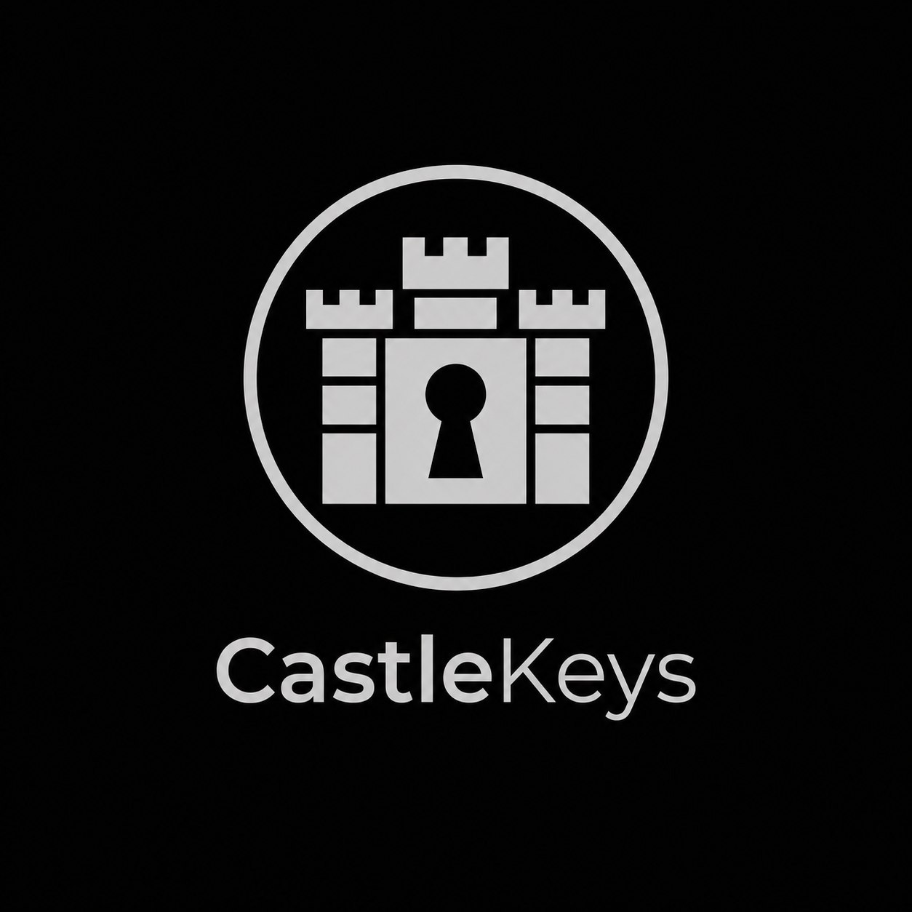

<h1 align="center">CastleKeys</h1>

**CastleKeys** - Куда безопаснее и удобнее, чем хранить пароли в браузере или заметках. 

---

### О программе:
Менедежер паролей для удобного и **безопасного хранения паролей**. *Программа была создана в первую очередь для собственного использования*. Все пароли **хешируются**. 

### Особенности: 
 * *Локальное сохранение паролей*
 * *Кроссплатфоременность* 
 * *Интеграция в браузер в виде расширения.* 
 * *Удобный поиск паролей и токенов.* 
 * *Возможность генерации случайных паролей.* 
 * *Возможност полной кастомизации и настройки программы.* 
 * *Возможность сохранять ключи доступа(API и токены)*
 * *Сохранение точкек wifi с расположением их на карте.*

### Использование программы и интерфейс

### Настройка и кастомизация

--- 