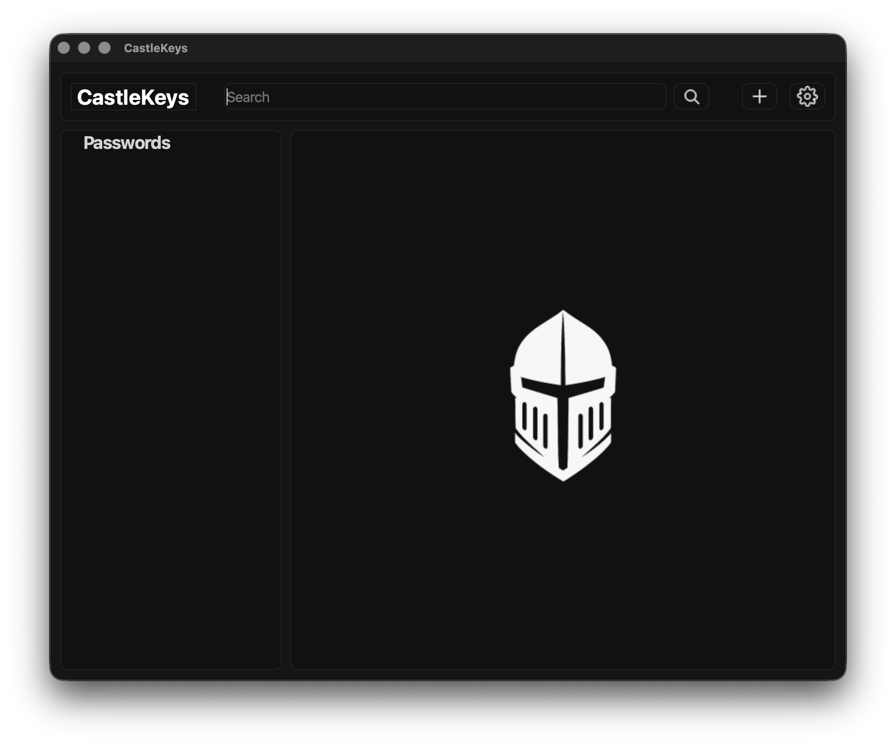
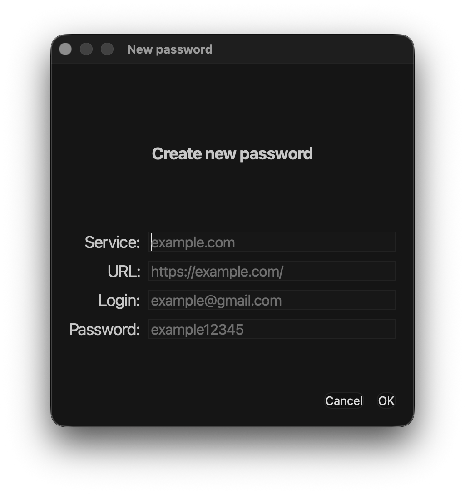
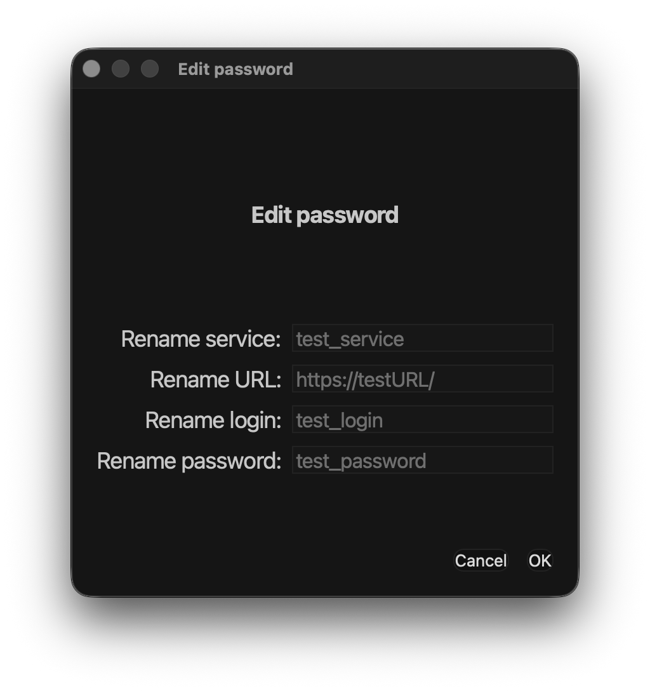
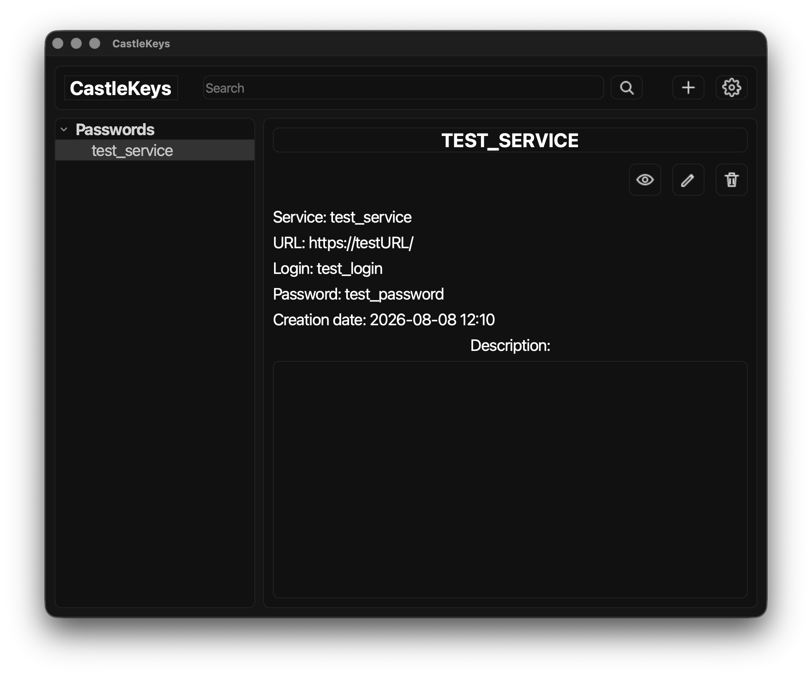

<h1 align="center">CastleKeys</h1>
<h3 align="center">Secure password storage</h3>

---

### About App:
**CastleKeys** - Менедежер паролей для удобного и **безопасного хранения паролей**. 

### Особенности: 
 * *Локальное сохранение паролей*
 * *Возможност полной кастомизации и настройки программы.*
 * *Удобное создание паролей*

### Interface
**Главное окно программы**. 
3 рабойчей области: 
* Верхняя - **toolbar**: поиск, добавление нового пароля и настройки
* Левая - **Tree**: список всех паролей
* Правая - **Main Workspace**: информация о пароле, работа с паролем

## ToolBar
#### Create New password
Чтобы добавить пароль, нужно нажать на плюс в левом верхнем углу и заполнить меню информацией о пароле. 

* **Service** - название сервиса(github, google)
* **URL** - ссылка на ресурс
* **Login** - логин
* **Password** - пароль

#### Edit Password

Чтобы изменить нужный пароль его нужно выбрать в дереве паролей слева и нажать на иконку карандаша в **right workspace** и заполнить новые данные. 

### Right Workspace

Кнопки скрытия, редактировани и удаления пароля. 

### Настройка и кастомизация
Настройка программы через *config.toml*
Настройка цветов программы themes/*theme.toml*(выбор темы в основном кофиге). 

### Will Be Soon
* Поиск
* Настройки через интерфейс 
* Иконка к паролю
* Теги