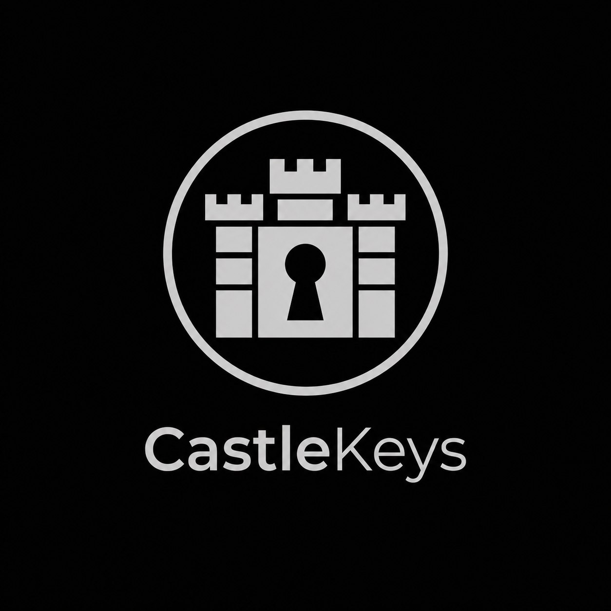
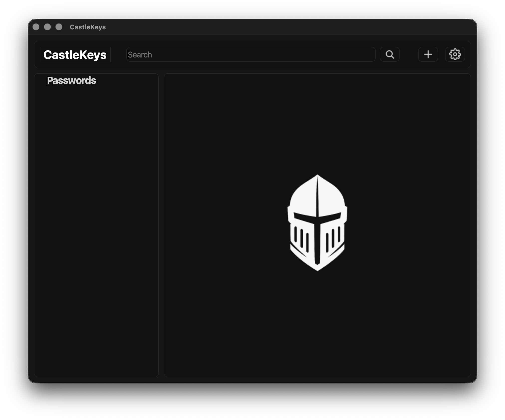
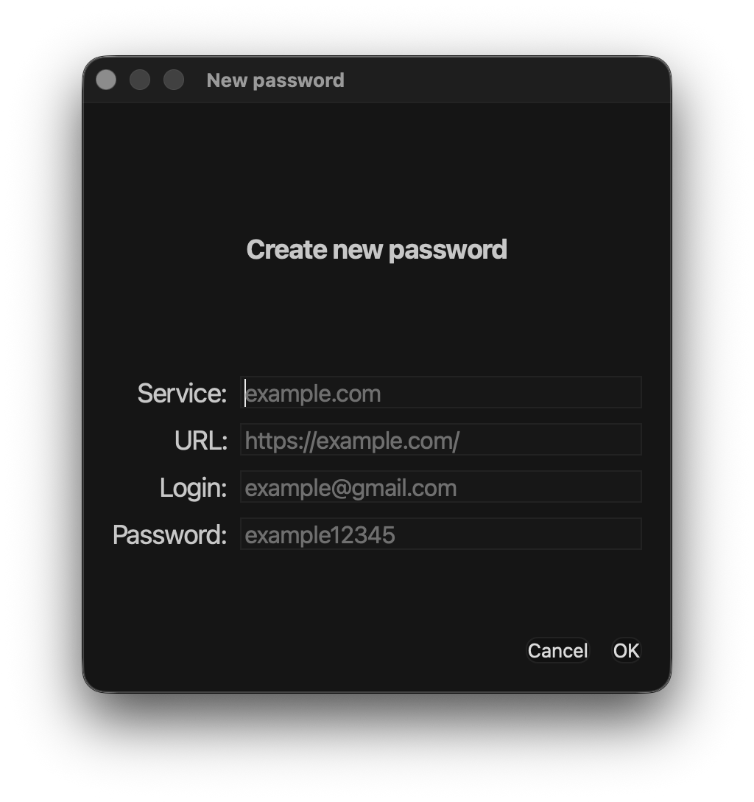
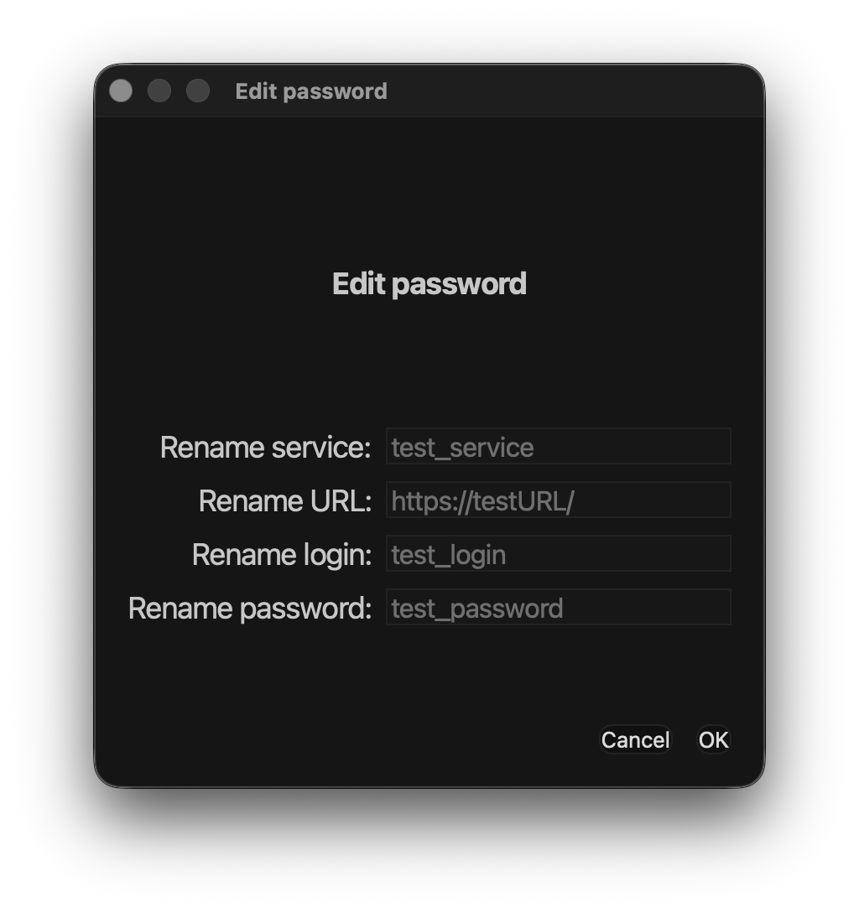
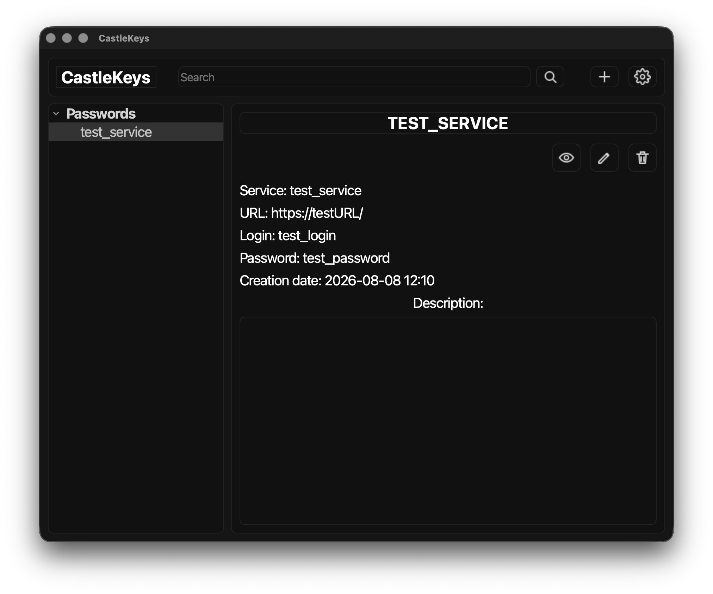

<h1 align="center">CastleKeys</h1>
<h3 align="center">Secure password storage</h3>

---

### About:
**CastleKeys** - A password manager for convenient and **secure password storage**. 

### Features: 
* Beautiful and intuitive interface
* Convenient password search by service name
* Safe storage
* Full customization

### Interface
**Main widnow**. 
3 work areas:
* Top section — **Toolbar**: search, add new password, and settings.
* Left section — **Tree**: list of all passwords.
* Right section — **Main workspace**: password details and password management.

## ToolBar
#### Create New password
To add a password, you need to click the plus sign in the top-left corner and fill in the menu with the password details. 

* **Service** - name of the service (GitHub, Google)
* **URL** - link to the resource
* **Login** - login
* **Password** - password.

#### Edit Password

To modify a specific password, select it from the password tree on the left, click the pencil icon in the **right workspace**, and enter the new details.

### Right Workspace

Buttons to hide, edit, and delete the password.

### Configuration and Customization
Configuring the program via *config.toml*
Configuring program colors via *themes/theme.toml* (select the theme in the main config).

### Coming Soon
* Interface-based settings
* Security
* Password icon
* Tags
